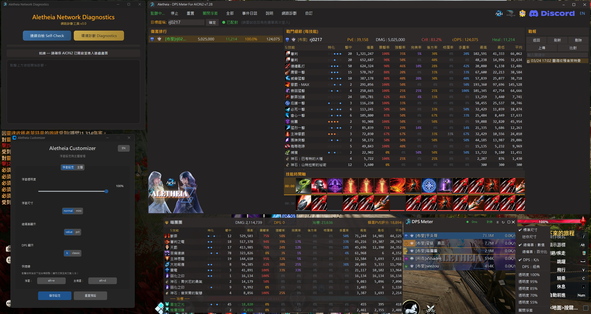
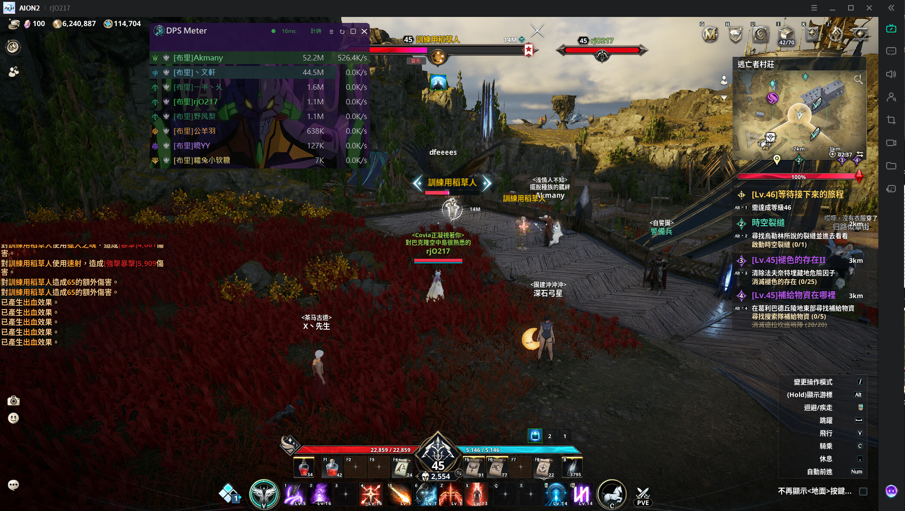
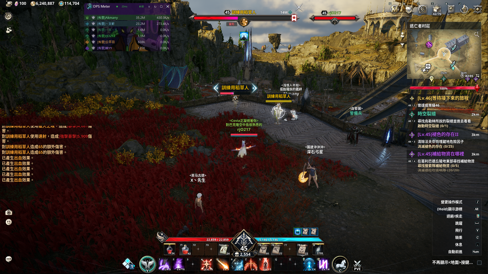
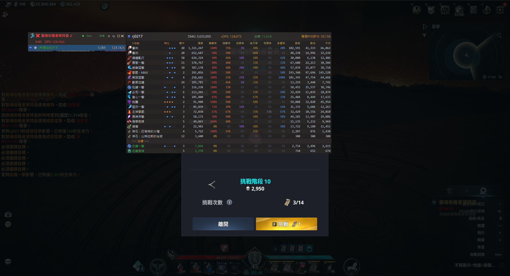

**[English](README_EN.md)** | **繁體中文**

# Aletheia — AION2 DPS Meter

非侵入式的 AION2（永恆紀元2，台版）即時 DPS 計量器。

透過網路封包分析（Passive Sniffing）技術即時計算戰鬥數據，**不修改遊戲記憶體、不竄改封包、不具備自動化操作功能**。

---

## 功能特色

### 四模式系統
- **全域模式** — 統計所有玩家的即時 DPS 排行
- **計時模式** — 木樁專用，10 秒無攻擊自動結算，DOT 不影響計時
- **副本模式** — 自動偵測進入副本，隊員傷害獨立統計，離開自動結算
- **BOSS 模式** — 白名單 BOSS 自動追蹤，死亡後自動結算

### 即時浮窗 (Overlay)
- 全 Canvas 化渲染，高效能零延遲
- 半透明浮窗，支援自訂背景圖
- Normal / Mini 兩種尺寸切換（右鍵選單）
- 右鍵切換顯示模式（總傷害/百分比、DPS 格式）
- **Hover 技能面板** — 滑鼠懸停排名列即時彈出完整技能明細
- 職業色計量條 + 文字陰影 + 種族圖標（天族/魔族）
- 配對狀態燈 + 網路延遲 RTT 顯示
- 設定持久化（透明度/尺寸/顯示模式自動記憶）

### 遊戲內實際畫面

| Normal 模式 | Mini 模式 |
|:---:|:---:|
|  |  |

### 戰鬥分析
- 技能明細：傷害佔比、暴擊率、平均命中、特化燈號
- 技能時間軸：施放順序紀錄，確認操作手法與連招
- 戰報系統：副本/BOSS/計時模式結算自動產生戰報
- **戰報面板** — 主視窗常駐面板，搜尋/篩選/上傳一站完成
- **戰報上傳** — 一鍵上傳至永恆蜂窩，分享戰鬥數據
- 召喚物傷害自動合併至主人名下
- 治癒技能獨立分區統計（傷害/治癒不互相擠壓）

### 戰報上傳

上傳戰報至永恆蜂窩，查看完整分析與技能時間軸：

| 戰報總覽 | 技能時間軸 |
|:---:|:---:|
|  |  |

### 其他
- 永恆蜂窩 PvE 評分 / 頭像 API 查詢
- 伺服器識別（36 伺服器）
- JSON 自訂主題系統（顏色、字體、背景）
- **Aletheia Customizer** — 獨立設定工具（浮窗設定/主題管理/熱鍵錄製）
- 通用加速器相容（ExitLag / UU / 雷神 / GearUP / LagoFast）
- 自動角色偵測（進入遊戲後自動識別暱稱）
- 系統匣常駐（關閉主視窗不退出，雙擊圖示叫回）

---

## 安裝與使用

### 系統需求
- Windows 10/11
- [Npcap](https://npcap.com/#download)（安裝時勾選「Install Npcap in WinPcap API-compatible Mode」）

### 快速上手
1. 安裝 Npcap
2. 下載最新版本 → [Releases](../../releases)
3. 解壓縮後，**右鍵 → 以系統管理員身份執行**
4. 進入遊戲即可看到數據

### 全域快捷鍵
| 快捷鍵 | 功能 |
|--------|------|
| `Alt+Q` | 顯示 / 隱藏浮窗 |
| `Alt+E` | 顯示 / 隱藏主視窗 |

> 快捷鍵可透過 Aletheia Customizer 或 settings.json 自訂。

---

## 常見問題

**Q: 為什麼沒有數據？**

A: 請確認已安裝 Npcap（WinPcap 相容模式）、以管理員身分執行、且遊戲正在執行中。

**Q: 延遲有數值但完全沒有傷害數據？**

A: v7.29 已自動相容大部分加速器。若仍有問題，請使用隨附的「Aletheia 網路診斷工具」進行自檢。

**Q: 為什麼一直跳防毒偵測？**

A: Windows Defender 的 ML 模型會對未購買 EV 簽章的程式產生誤判。目前請將主程式（Aletheia_DPS_Meter_AION2.exe）、風格自訂器（Aletheia_Customizer.exe）、網路診斷工具（Aletheia_Diag.exe）加入排除清單。未來有資金時會考慮購買 EV 程式碼簽章憑證。

**Q: 數據準確嗎？**

A: v7.29 加入 LZ4 壓縮封包解壓，修復了多人場景傷害數據不完整的問題。神石傷害、召喚物傷害均已計入總量。

---

## 免責聲明

本程式僅供技術交流與戰鬥數據分析使用。僅透過網路封包分析技術計算戰鬥數據，不修改遊戲記憶體、不竄改通訊封包，亦不具備任何自動化操作功能。

儘管採非侵入式設計，但官方對「第三方輔助程式」定義不一。使用前請自行評估 AION2 官方政策。若因使用本工具導致帳號受限或任何損失，開發者不負法律責任或補償義務，執行程式即視為同意此聲明。

---

## 聯絡與贊助

- Discord：https://discord.gg/x52CBg4rcE
- 開發者信箱：dont.stop.ha@gmail.com
- 贊助（中國信託 822）：7505-4015-7378

您的一杯咖啡，是我們繼續努力的動力。
