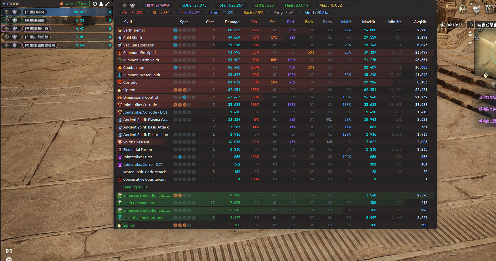
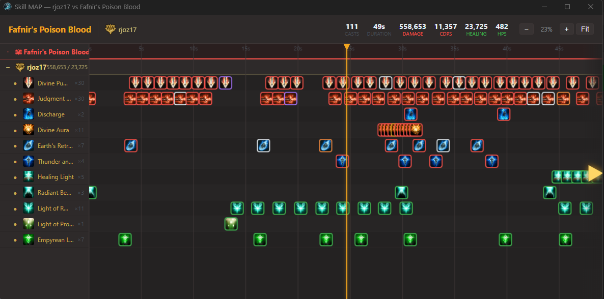
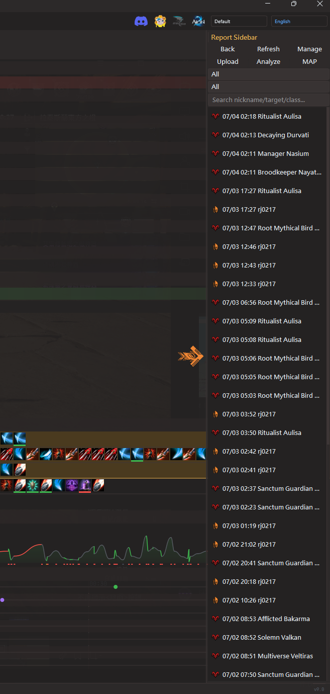
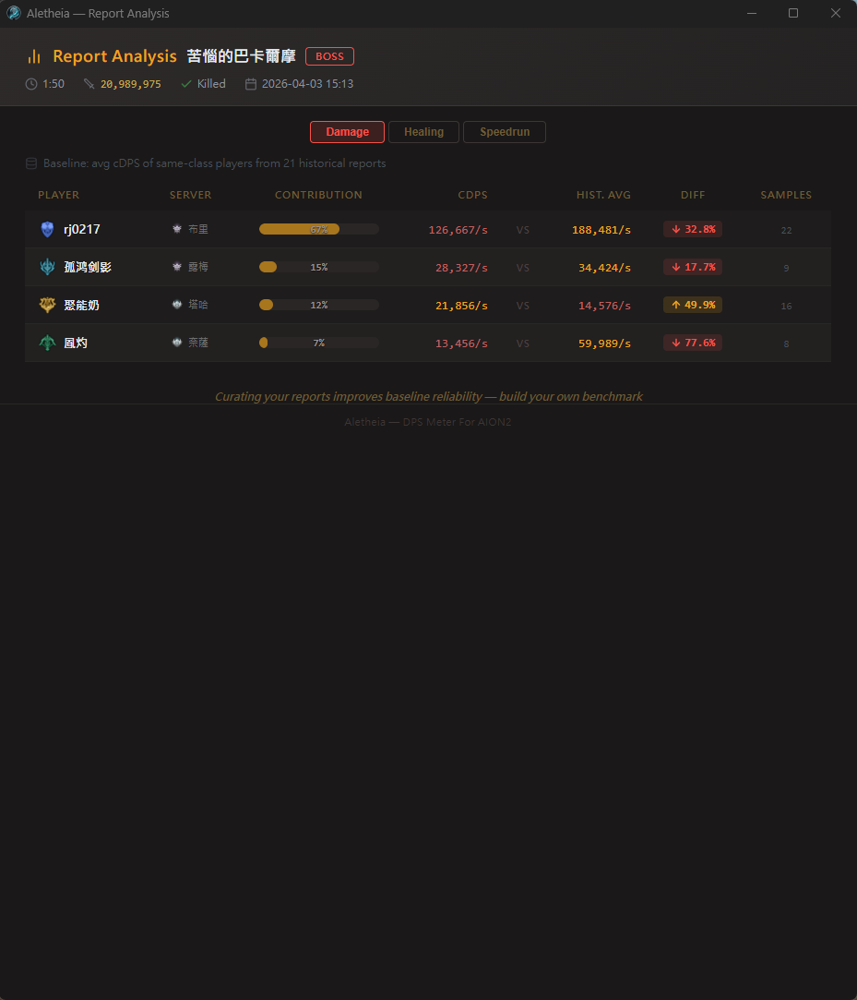
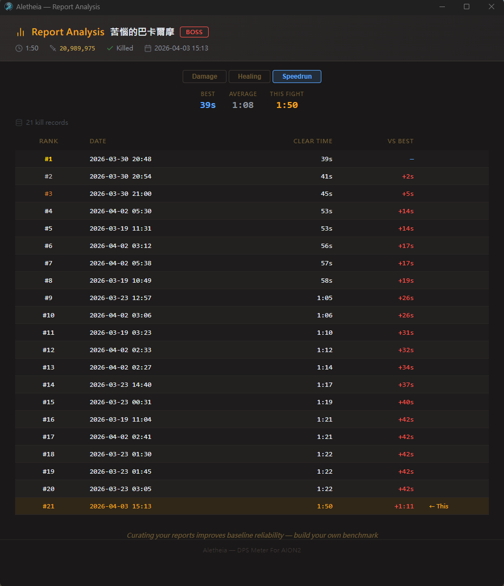
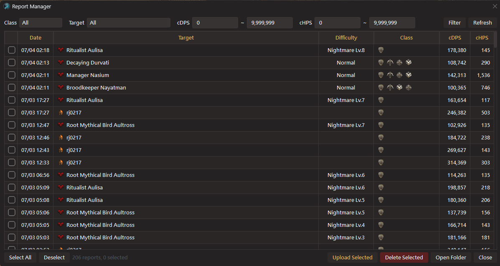
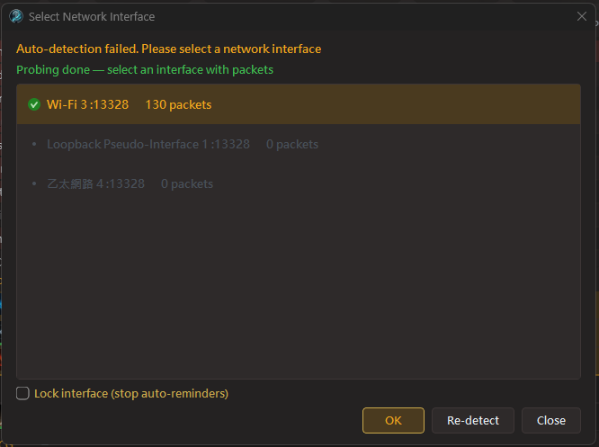
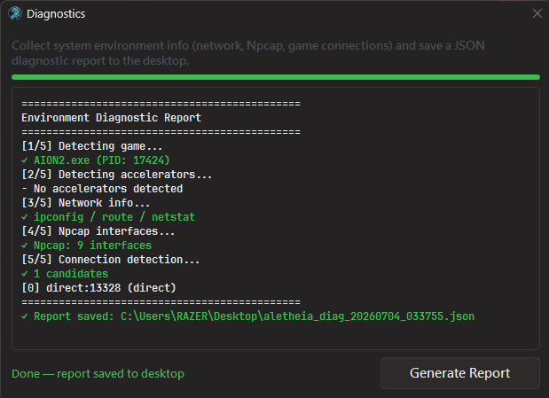
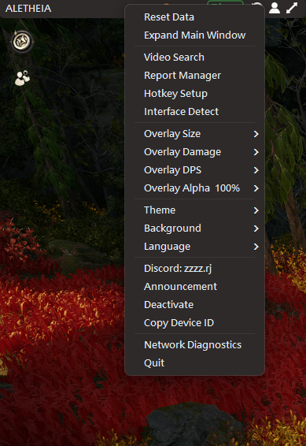

**English** | **[繁體中文](README_ZH.md)** | **[简体中文](README_CN.md)**

# Aletheia — AION2 DPS Meter

A non-invasive, real-time DPS meter for AION2 (Aion: Legions of War, TW server).

Calculates combat data in real time via passive network packet sniffing — **no memory modification, no packet tampering, no automation of any kind**.

## Support the Project

If this tool has been useful to you, please consider supporting continued development:

### ☕ Ko-fi — recommended

[](https://ko-fi.com/rj0217)

Direct link: [ko-fi.com/rj0217](https://ko-fi.com/rj0217)

### 🪙 Crypto — USDT / USDC (BEP20 / BSC network)

```
0x55c439b27807415e80452f59ba00fee3441a802d
```

### 💬 Contact

- **Discord**: https://discord.gg/x52CBg4rcE
- **Email**: dont.stop.ha@gmail.com

Your support keeps this project alive.

---


---

## Features

### Three Display Modes
- **Global** — Real-time DPS rankings for all nearby players
- **Timer** — Training dummy mode with 10s idle auto-finalize; DOT does not extend the timer
- **Boss** — Whitelisted bosses are tracked automatically; auto-finalize on boss death

> The legacy Dungeon mode has been retired (old dungeon reports remain readable).

### Real-Time Overlay
- QPainter custom rendering, high performance with zero lag
- Frameless window with edge-snapping — drag near the game window and the overlay auto-aligns to its edges
- Title bar control buttons: Reset / Personal Report / Expand Main Window (v9.0)
- Semi-transparent overlay, background opacity affects only the backdrop (text stays fully opaque)
- Normal / Mini size toggle (right-click menu)
- Right-click menu integrates all customization (size/damage format/DPS format/opacity/background/theme)
- **Hover Skill Panel** — hover over a player's rank row to see full skill breakdown
- **Cast ECG** — waveform visualization of skill cast rhythm (wave height = damage, wave color = cast speed)
- **Buff Timeline** — Gantt of buff cast timing + per-buff count capsules, color-coded by direction (v9.0)
- **Damage Type Capsules** — seven-type breakdown (Crit / Heavy / Perfect / Frontal / Back / Block / Multi-hit), aligned with the official meter (v9.0)
- **DOT Classification** — direct hits and DOT damage split automatically
- **Auto-Position** — overlay snaps to the game window on startup
- Metallic nickname text + class-colored gradient bars + hover glow effect + faction icons
- Pairing status indicator + real-time network latency (RTT) + accelerator detection
- 4K DPI auto-scaling
- Persistent settings (opacity/size/display mode auto-saved)

### In-Game Screenshots


| Mini Mode | Combat Detail (Buff Timeline + Damage Capsules) |
|:---:|:---:|
|  |  |

### Skill MAP — Full Party Skill Timeline

A 2D timeline view of the entire party's skill casts — "What was everyone doing at this exact moment?"

- X-axis = time, Y-axis = one row per skill per player
- Multi-level collapse (player-level + skill-level), skill hide/restore
- Region select analysis (Alt+drag) — cross-player stats for casts / damage / CPM
- Semantic-colored skill icon borders (crit red / strong orange / perfect purple / DoT cyan / heal green)
- Playhead-centered zoom, Fit button, combo chain grouping

| Full Party Overview + Region Select | Zoomed-In Skill Detail |
|:---:|:---:|
|  |  |

| English Mode with Healing Stats |
|:---:|
|  |

### Combat Analysis
- Skill breakdown: damage share, crit rate, average hit, specialization indicators
- Skill timeline: cast sequence tracking for rotation and combo analysis
- **cHPS Healing Stats** — combat detail, reports, and analyzer all support healing metrics
- **Personal Report Window** — one click on the overlay opens your latest 20 reports with full personal combat detail (v9.0)
- Report system: auto-generated reports on boss/timer session finalization
- **Report Management** — browse, filter (class/cDPS/cHPS range + target), batch delete
- **Report Panel** — sidebar drawer with search/filter/upload
- **Report Upload** — one-click upload to Eternal Hive or Aletheia Community; other players auto-anonymized (v9.0)
- **Report Analyzer** — compare performance against historical class averages, with DPS/HPS/speedrun modes
- Summon damage automatically merged under the summoner
- Healing skills tracked in a separate section (damage/healing don't overlap)

| Personal Report Window (v9.0) | Report Sidebar |
|:---:|:---:|
|  |  |

### Report Upload

Upload combat reports to Eternal Hive for detailed analysis and skill timelines:

| Report Overview | Skill Timeline |
|:---:|:---:|
|  |  |

### Video Search (YouTube / Bilibili / Niconico)


### Companion Tools

| Report Analyzer (DPS) | Report Analyzer (HPS) |
|:---:|:---:|
|  |  |

| Report Analyzer (Speedrun) | Report Management |
|:---:|:---:|
|  |  |

| Interface Selection | Environment Diagnostics |
|:---:|:---:|
|  |  |

| Right-Click Menu (Unified) |
|:---:|
|  |

- **Aletheia Analyzer** — report analysis with DPS/HPS/speedrun modes, compare against historical class averages
- **Aletheia SkillMAP** — full party skill timeline, 2D MAP visualization of all party members' skill casts
- **Environment Diagnostics** — integrated into main window, one-click system info collection and JSON report export

### Additional Features
- Eternal Hive PvE score / avatar API integration
- Server identification (36 servers)
- JSON theme system (dark/light base groups, colors, fonts, backgrounds)
- Universal accelerator support (ExitLag / UU / Razer / GearUP / LagoFast / Clash)
- Accelerator auto-detection — status bar shows detected accelerator name and port, auto-switch on packet loss
- Auto character detection (automatically identifies your character on login)
- System tray icon (closing main window keeps app running; double-click to restore)
- Win32 API hotkeys — no global keyboard hooks, zero interference with macros
- Tri-lingual switching (繁體中文 / 简体中文 / English), instant effect without restart
- Full English localization for skills, dungeons, and boss names

---

## Installation & Usage

### Requirements
- Windows 10/11
- [Npcap](https://npcap.com/#download) (check "Install Npcap in WinPcap API-compatible Mode" during installation)

### Quick Start
1. Install Npcap
2. Download the latest version → [Releases](../../releases)
3. Extract, then **right-click → Run as Administrator**
4. On first launch, sign in with Discord (required to enter the main window). Optionally activate an `AION2-XXXX-XXXX` serial for Pro — without it the main window is blurred, but the overlay and basic monitoring still work.
5. Launch the game and data will appear automatically

### Global Hotkeys
| Hotkey | Function |
|--------|----------|
| `Alt+Q` | Show / Hide overlay |
| `Alt+E` | Show / Hide main window |

> Hotkeys are customizable via right-click menu or settings.json.

---

## FAQ

**Q: Why is there no data?**

A: Make sure Npcap is installed (WinPcap-compatible mode), the application is running as Administrator, and the game is active.

**Q: Latency shows a value but there is no damage data?**

A: v8.0 automatically supports most game accelerators with candidate auto-switching. If issues persist, use the built-in environment diagnostics for self-diagnosis.

**Q: Why does my antivirus keep flagging it?**

A: Windows Defender's ML model may flag executables without an EV code signing certificate. Please add the main program and companion tools to your exclusion list. We plan to purchase an EV certificate when funding allows.

**Q: How accurate is the data?**

A: v8.0 includes combo chain grouping, DOT classification, skill merging, and improved damage-attribution precision. Godstone and summon damage are included in totals. v9.0 realigns the damage protocol (Heavy / Crit / Back / Multi-hit) to be 100% consistent with the official meter.

**Q: The overlay isn't visible in Exclusive Fullscreen?**

A: Exclusive Fullscreen bypasses the Windows DWM compositor, so all topmost overlays (Discord / Steam / NVIDIA included) stop rendering. Use Borderless / Windowed Fullscreen instead — visually identical, and the overlay stays on top.

---

## Disclaimer

This software is provided solely for technical research and combat data analysis. It calculates combat data exclusively through passive network packet analysis — it does not modify game memory, alter network packets, or provide any form of automation.

Despite its non-invasive design, the game publisher's definition of "third-party tools" may vary. Please review AION2's official policy before use. The developer assumes no legal liability or obligation to compensate for any account restrictions or losses resulting from the use of this software. By running the application, you agree to this disclaimer.

---

## Contact

- Discord: https://discord.gg/x52CBg4rcE
- Email: dont.stop.ha@gmail.com

See [Support the Project](#support-the-project) section above for donation channels.
