**[English](README.md)** | **[繁體中文](README_ZH.md)** | **简体中文**

# Aletheia — AION2 DPS Meter

非侵入式的 AION2（永恒纪元2，台服）实时 DPS 计量器。

通过网络封包分析（Passive Sniffing）技术实时计算战斗数据，**不修改游戏内存、不篡改封包、不具备自动化操作功能**。

## 支持本项目

如果这个工具对你有帮助，欢迎支持我们继续开发：

**银行转账（中国信托 822）**

```
7505-4015-7378
```

**加密货币 — USDT / USDC（BEP20 / BSC 链）**

```
0x55c439b27807415e80452f59ba00fee3441a802d
```

**Discord**：https://discord.gg/x52CBg4rcE
**开发者邮箱**：dont.stop.ha@gmail.com

您的一杯咖啡，是我们继续努力的动力。

---

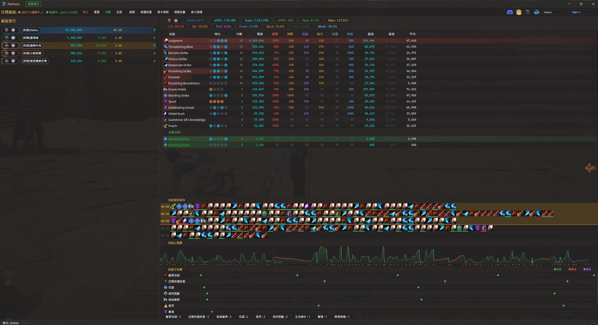

---

## 功能特色

### 四模式系统
- **全域模式** — 统计所有玩家的实时 DPS 排行
- **计时模式** — 木桩专用，10 秒无攻击自动结算，DOT 不影响计时
- **副本模式** — 自动侦测进入副本，队员伤害独立统计，离开自动结算
- **BOSS 模式** — 白名单 BOSS 自动追踪，死亡后自动结算

### 实时浮窗 (Overlay)
- QPainter 自绘渲染，高性能零延迟
- 半透明浮窗，背景透明度仅影响底图（文字保持不透明）
- Normal / Mini 两种尺寸切换（右键菜单）
- 右键菜单整合自定义功能（尺寸/��害格式/DPS格式/透明度/背景图/主题）
- **Hover 技能面板** — 鼠标悬停排名行即时弹出完整技能明细
- **技能心电图 Cast ECG** — 波形图呈现技能施放节奏（波高=伤害量、波色=衔接速度）
- **DOT 分类** — 同技能直击与持续伤害自动分开显示
- **自动定位** — 启动时自动贴齐游戏窗口左上角
- 金属质感昵称 + 职业色渐变量条 + hover 呼吸光效 + 种族图标
- 配对状态灯 + 网络延迟 RTT + 加速器侦测状态
- 4K DPI 自适应缩放
- 设置持久化（透明度/尺寸/显示模式自动记忆）

### 游戏内实际画面

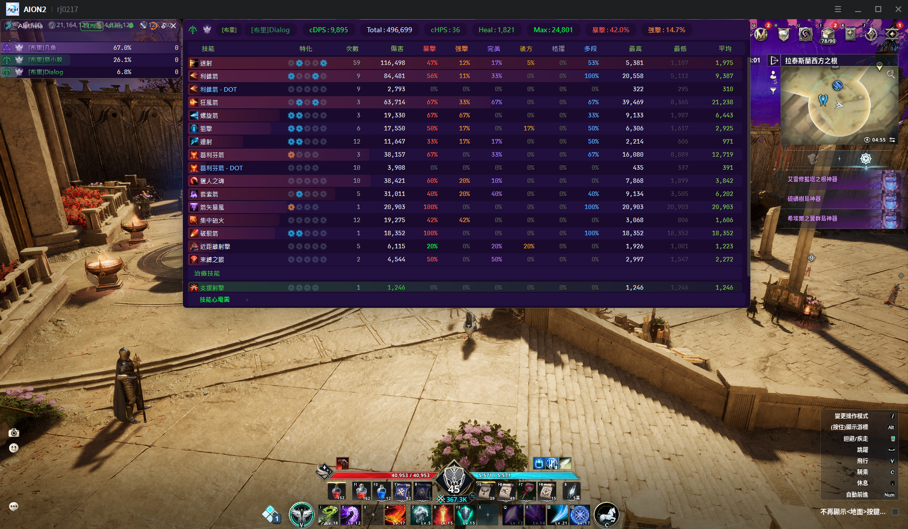

| Mini 模式 |
|:---:|
| 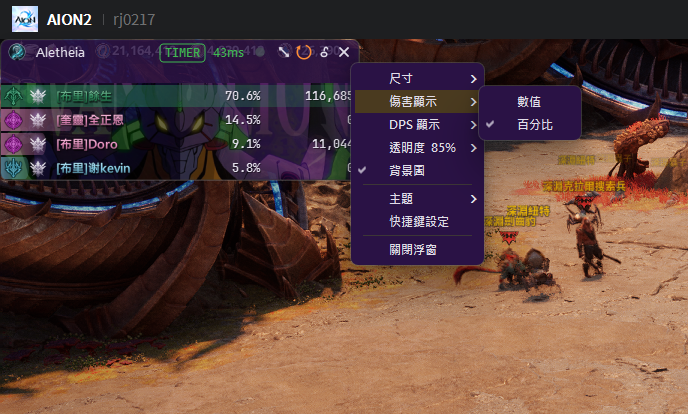 |

### Skill MAP — 全队技能时间轴

以 2D 时间轴呈现全队技能施放记录 — 「这个时刻，全队每个人在做什么」。

- X 轴为时间、Y 轴为每位玩家的每个技能独立一行
- 多层收合（玩家级 + 技能级）、技能隐藏/恢复
- 框选分析（Alt+拖拽）— 穿透多人统计 casts / damage / CPM
- ��能图标语义色外框（暴击红/强击橙/完美紫/DoT 浅蓝/治愈绿）
- 定位线缩放、Fit 一键适配、连续技分组

| 全队总览 + 框选统计 | 放大查看技能细节 |
|:---:|:---:|
| 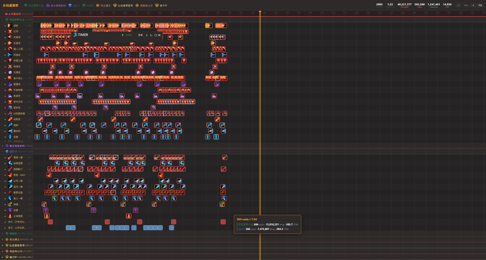 |  |

### 战斗分析
- 技能明细：伤害占比、暴击率、平均命中、特化灯号
- 技能时间轴：施放顺序记录，确认操作手法与连招
- **cHPS 治愈统计** — 战斗细节、战报、分析工具全面支持治愈量统计
- 战报系统：副本/BOSS/计时模式结算自动产生战报
- **战报管理** — 浏览、筛选（职业/cDPS/cHPS 范围）、批量删除
- **战报面板** — 主窗口侧边抽屉，搜索/筛选/上传一站完成
- **战报上传** — 一键上传至永恒蜂窝，分享战斗数据
- **战报分析** — 伤害占比及同职业历史平均对比，支持 DPS/HPS/竞速三种模式
- 召唤物伤害自动合并至主人名下
- 治愈技能独立分区统计（伤害/治愈不互相挤压）

### 战报上传

上传战报至永恒蜂窝，查看完整分析与技能时间轴：

| 战报总览 | 技能时间轴 |
|:---:|:---:|
| 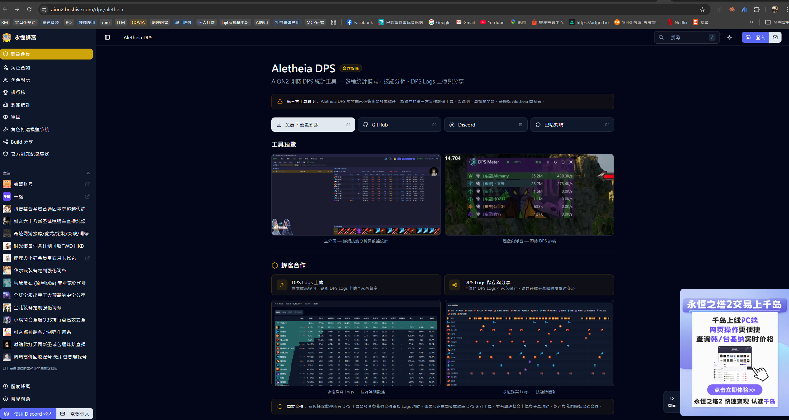 | 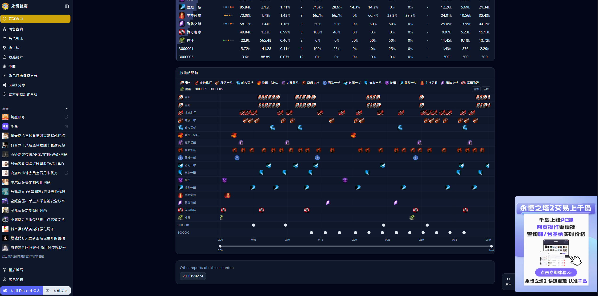 |

### 附属工具

| 战报分析（DPS） | 战报分析（HPS） |
|:---:|:---:|
| 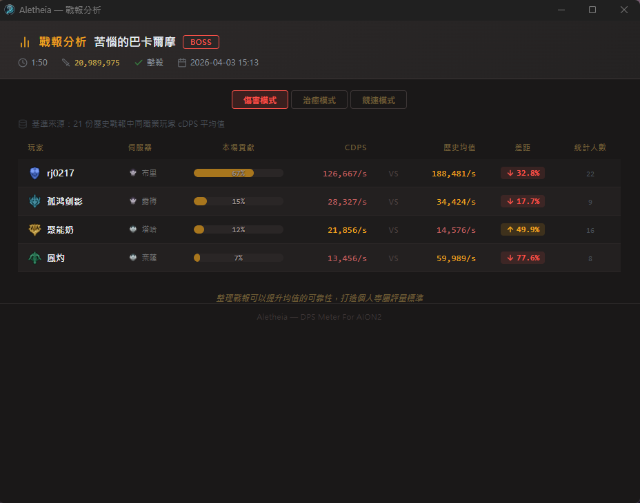 | 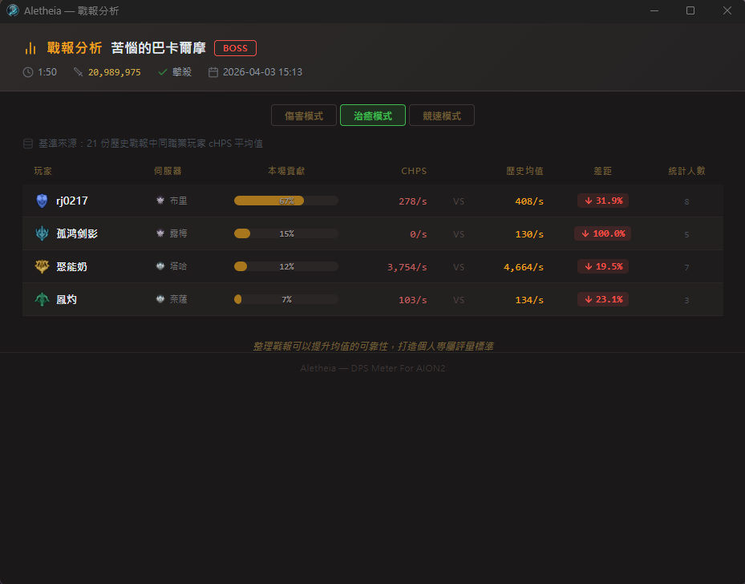 |

| 战报分析（竞速模式） |
|:---:|
| 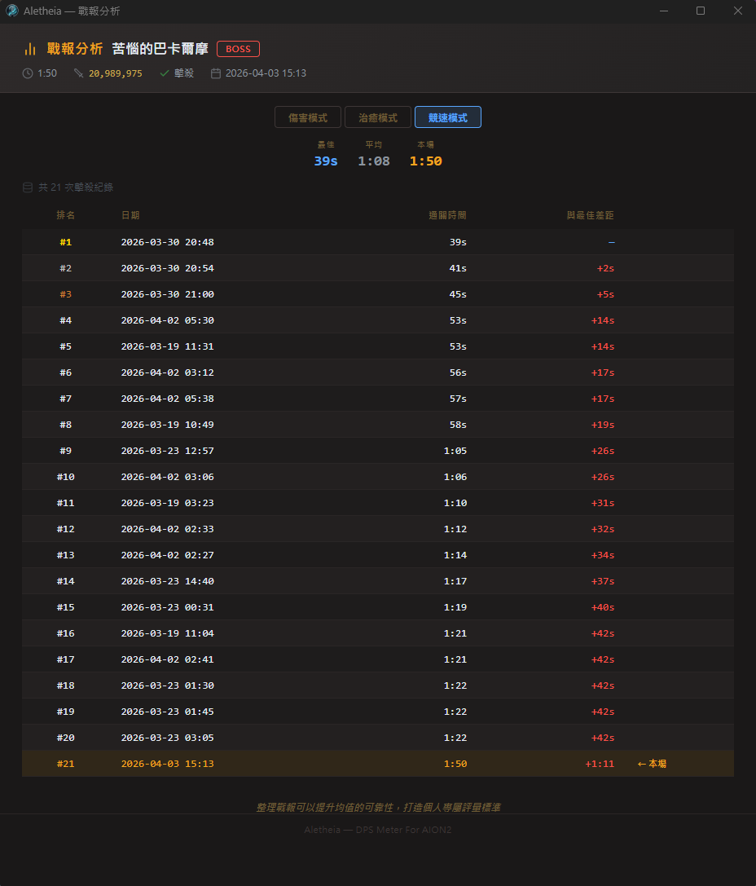 |

| 网卡选择 | 环境诊断 |
|:---:|:---:|
| 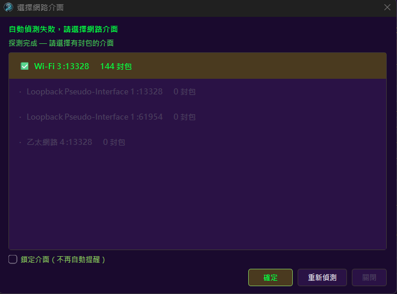 | 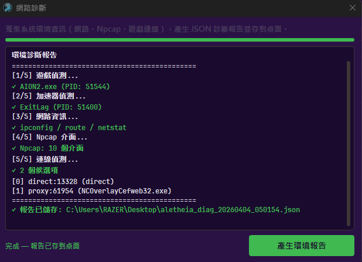 |

- **Aletheia Analyzer** — 战报分析工具，DPS/HPS/竞速三种模式，查看个人表现与历史平均对比
- **Aletheia SkillMAP** — 全队技能时间轴，以 2D MAP 呈现全队技能施放记录
- **环境诊断** — 整合至主窗口，一键收集系统信息导出 JSON 报告

### 其他
- 永恒蜂窝 PvE 评分 / 头像 API 查询
- 服务器识别（36 服务器）
- JSON 自定义主题系统（深色/浅色基础群，颜色、字体、背景）
- 通用加速器兼容（ExitLag / UU / 雷神 / GearUP / LagoFast / Clash）
- 加速器自动侦测 — 状态栏显示侦测到的加速器名称及 port，封包中断自动切换候选连接
- 自动角色侦测（进入游戏后自动识别昵称）
- 系统托盘常驻（关闭主窗口不退出，双击图标召回）
- 快捷键使用 Win32 API，宏用户不再卡顿
- 三语切换（繁體中文 / 简体中文 / English），即时生效无需重启
- 技能/副本/BOSS 名称英文化

---

## 安装与使用

### 系统要求
- Windows 10/11
- [Npcap](https://npcap.com/#download)（安装时勾选「Install Npcap in WinPcap API-compatible Mode」）

### 快速上手
1. 安装 Npcap
2. 下载最新版本 → [Releases](../../releases)
3. 解压缩后，**右键 → 以管理员身份运行**
4. 进入游戏即可看到数据

### 全局快捷键
| 快捷键 | 功能 |
|--------|------|
| `Alt+Q` | 显示 / 隐藏浮窗 |
| `Alt+E` | 显示 / 隐藏主窗口 |

> 快捷键可通过右键菜单或 settings.json 自定义。

---

## 常见问题

**Q: 为什么没有数据？**

A: 请确认已安装 Npcap（WinPcap 兼容模式）、以管理员身份运行、且游戏正在运行中。

**Q: 延迟有数值但完全没有伤害数据��**

A: v8.0 已自动兼容大部分加速器，支持候选连接自动切换。若仍有问题，请使用主窗口内置的环境诊断功能进行自检。

**Q: 为什么一直跳杀毒软件检测？**

A: Windows Defender 的 ML 模型会对未购买 EV 签名的程序产生误判。目前请将主程序及辅助工具加入排除列表。未来有资金时会考虑购买 EV 代码签名证书。

**Q: 数据准确吗���**

A: v8.0 包含连续技分组、DOT 分类、技能合并及 Protobuf tag 升级，伤害数据更加精确。神石伤害、召唤物伤害均已计入总量。

---

## 免责声明

本程序仅供技术交流与战斗数据分析使用。仅通过网络封包分析技术计算战斗数据，不修改游戏内存、不篡改通信封包，亦不具备任何自动化操作功能。

尽管采用非侵入式设计，但官方对「第三方辅助程序」定义不一。使用前请自行评估 AION2 官方政策。若因使用本工具导致账号受限或任何损失，开发者不负法律责任或补偿义务，运行程序即视为同意此声明��

---

## 联系

- Discord：https://discord.gg/x52CBg4rcE
- 开发者邮箱：dont.stop.ha@gmail.com

赞助渠道请见顶部的 [支持本项目](#支持本项目) 区块。
