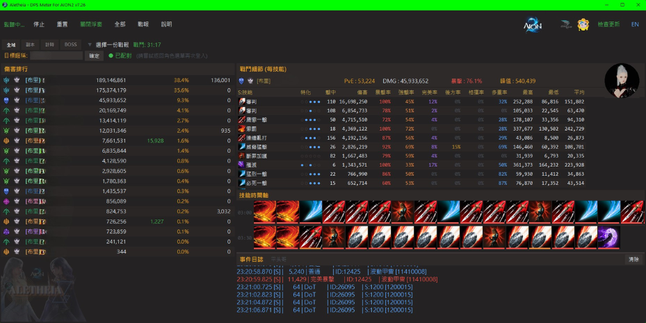
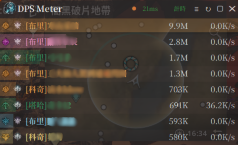
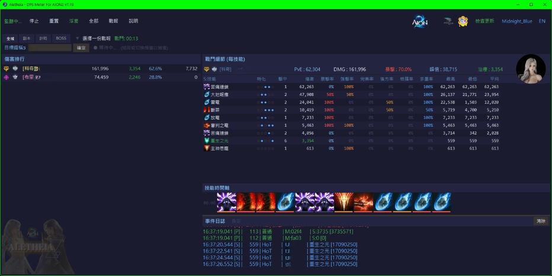
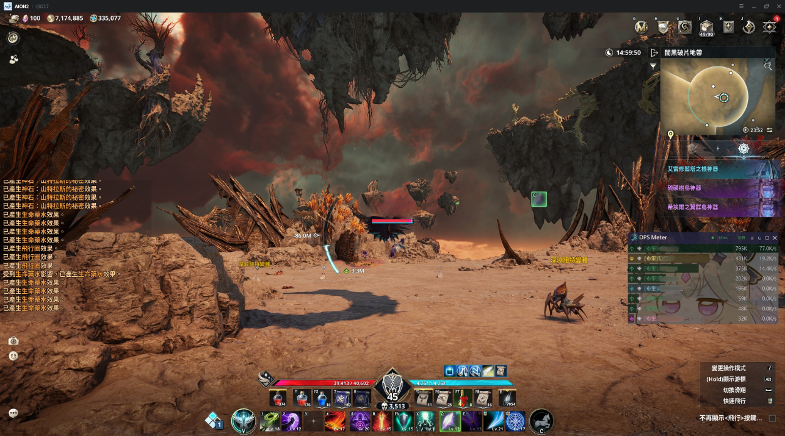
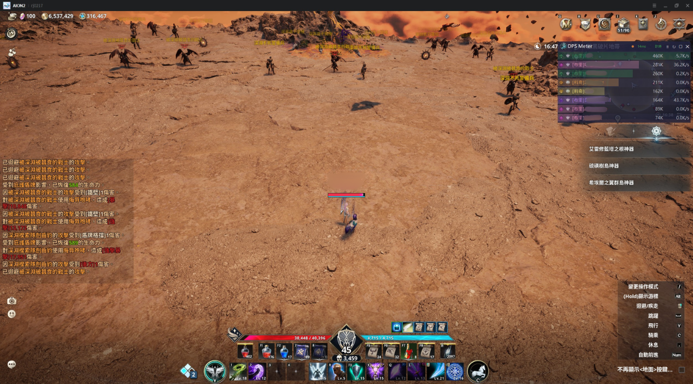

# Aletheia — AION2 DPS Meter

A non-invasive, real-time DPS meter for AION2 (Aion: Legions of War, TW server).

Calculates combat data in real time via passive network packet sniffing — **no memory modification, no packet tampering, no automation of any kind**.

---

## Features

### Four Display Modes
- **Global** — Real-time DPS rankings for all nearby players
- **Timer** — Training dummy mode with 10s idle auto-finalize; DOT does not extend the timer
- **Dungeon** — Automatically activates upon entering an instance; independent party stats, auto-finalize on exit
- **Boss** — Whitelisted bosses are tracked automatically; auto-finalize on boss death

### Real-Time Overlay
- Fully Canvas-rendered, high performance with zero lag
- Rounded semi-transparent overlay with custom background image support
- Dual-line title (name + timer/damage)
- Class-colored DPS bars + faction icons (Elyos / Asmodian)
- Pairing status indicator + real-time network latency (RTT)

### Combat Analysis
- Skill breakdown: damage share, crit rate, average hit, specialization indicators
- Skill timeline: cast sequence tracking for rotation and combo analysis
- Report system: auto-generated reports on dungeon/boss/timer session finalization
- Summon damage automatically merged under the summoner

### Additional Features
- Eternal Hive PvE score / avatar API integration
- Server identification (36 servers)
- JSON theme system (colors, fonts, backgrounds)
- ExitLag accelerator auto-compatibility
- Auto-update system

### In-Game Screenshots

| | |
|:---:|:---:|
|  |  |

---

## Installation & Usage

### Requirements
- Windows 10/11
- [Npcap](https://npcap.com/#download) (check "Install Npcap in WinPcap API-compatible Mode" during installation)

### Quick Start
1. Install Npcap
2. Download the latest version → [Releases](../../releases)
3. Extract, then **right-click → Run as Administrator**
4. Launch the game and data will appear automatically

### Global Hotkeys
| Hotkey | Function |
|--------|----------|
| `Ctrl+Q` | Start / Stop monitoring |
| `Ctrl+W` | Show / Hide overlay |
| `Ctrl+S` | Open / Close report viewer |
| `Ctrl+Z` | Show / Hide main window |

---

## FAQ

**Q: Why is there no data?**
A: Make sure Npcap is installed (WinPcap-compatible mode), the application is running as Administrator, and the game is active.

**Q: Latency shows a value but there is no damage data?**
A: Network offloading (LSO) or a game accelerator may be interfering with packet capture. Try reinstalling Npcap, disabling Large Send Offload on your network adapter, or adjusting your accelerator's launch order.

**Q: How accurate is the data?**
A: This tool uses non-invasive packet analysis; accuracy depends on packet identification. Godstone damage is included in totals.

---

## Disclaimer

This software is provided solely for technical research and combat data analysis. It calculates combat data exclusively through passive network packet analysis — it does not modify game memory, alter network packets, or provide any form of automation.

Despite its non-invasive design, the game publisher's definition of "third-party tools" may vary. Please review AION2's official policy before use. The developer assumes no legal liability or obligation to compensate for any account restrictions or losses resulting from the use of this software. By running the application, you agree to this disclaimer.

---

## Contact & Support

- Discord: https://discord.gg/x52CBg4rcE
- Email: dont.stop.ha@gmail.com
- Donate (CTBC Bank 822): 7505-4015-7378

Your support keeps this project alive.
