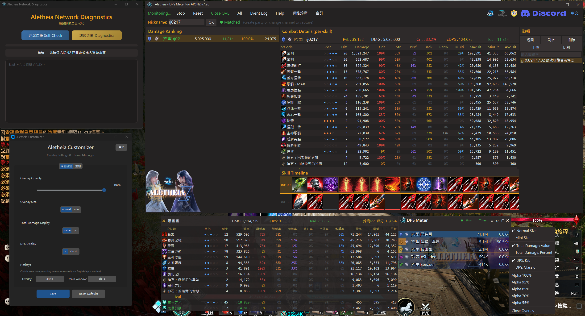

# Aletheia — AION2 DPS Meter

A non-invasive, real-time DPS meter for AION2 (Aion: Legions of War, TW server).

Calculates combat data in real time via passive network packet sniffing — **no memory modification, no packet tampering, no automation of any kind**.

---

## Features

### Four Display Modes
- **Global** — Real-time DPS rankings for all nearby players
- **Timer** — Training dummy mode with 10s idle auto-finalize; DOT does not extend the timer
- **Dungeon** — Automatically activates upon entering an instance; independent party stats, auto-finalize on exit
- **Boss** — Whitelisted bosses are tracked automatically; auto-finalize on boss death

### Real-Time Overlay
- Fully Canvas-rendered, high performance with zero lag
- Semi-transparent overlay with custom background image support
- Normal / Mini size toggle (right-click menu)
- Right-click to switch display modes (total damage/percentage, DPS format)
- **Hover Skill Panel** — hover over a player's rank row to see full skill breakdown
- Class-colored DPS bars + text shadows + faction icons (Elyos / Asmodian)
- Pairing status indicator + real-time network latency (RTT)
- Persistent settings (opacity/size/display mode auto-saved)

### In-Game Screenshots

| Normal Mode | Mini Mode |
|:---:|:---:|
|  |  |

### Combat Analysis
- Skill breakdown: damage share, crit rate, average hit, specialization indicators
- Skill timeline: cast sequence tracking for rotation and combo analysis
- Report system: auto-generated reports on dungeon/boss/timer session finalization
- **Report Panel** — built-in panel with search/filter/upload
- **Report Upload** — one-click upload to Eternal Hive for sharing
- Summon damage automatically merged under the summoner
- Healing skills tracked in a separate section (damage/healing don't overlap)

### Report Upload

Upload combat reports to Eternal Hive for detailed analysis and skill timelines:

| Report Overview | Skill Timeline |
|:---:|:---:|
|  |  |

### Additional Features
- Eternal Hive PvE score / avatar API integration
- Server identification (36 servers)
- JSON theme system (colors, fonts, backgrounds)
- **Aletheia Customizer** — standalone settings tool (overlay config/theme management/hotkey recording)
- Universal accelerator support (ExitLag / UU / Razer / GearUP / LagoFast)
- Auto character detection (automatically identifies your character on login)
- System tray icon (closing main window keeps app running; double-click to restore)

---

## Installation & Usage

### Requirements
- Windows 10/11
- [Npcap](https://npcap.com/#download) (check "Install Npcap in WinPcap API-compatible Mode" during installation)

### Quick Start
1. Install Npcap
2. Download the latest version → [Releases](../../releases)
3. Extract, then **right-click → Run as Administrator**
4. Launch the game and data will appear automatically

### Global Hotkeys
| Hotkey | Function |
|--------|----------|
| `Alt+Q` | Show / Hide overlay |
| `Alt+E` | Show / Hide main window |

> Hotkeys are customizable via Aletheia Customizer or settings.json.

---

## FAQ

**Q: Why is there no data?**

A: Make sure Npcap is installed (WinPcap-compatible mode), the application is running as Administrator, and the game is active.

**Q: Latency shows a value but there is no damage data?**

A: v7.29 automatically supports most game accelerators. If issues persist, use the included "Aletheia Network Diagnostic Tool" for self-diagnosis.

**Q: Why does my antivirus keep flagging it?**

A: Windows Defender's ML model may flag executables without an EV code signing certificate. Please add the main program (Aletheia_DPS_Meter_AION2.exe), Customizer (Aletheia_Customizer.exe), and Network Diagnostics (Aletheia_Diag.exe) to your exclusion list. We plan to purchase an EV certificate when funding allows.

**Q: How accurate is the data?**

A: v7.29 added LZ4 compressed packet decompression, fixing incomplete damage data in multi-player scenarios. Godstone and summon damage are included in totals.

---

## Disclaimer

This software is provided solely for technical research and combat data analysis. It calculates combat data exclusively through passive network packet analysis — it does not modify game memory, alter network packets, or provide any form of automation.

Despite its non-invasive design, the game publisher's definition of "third-party tools" may vary. Please review AION2's official policy before use. The developer assumes no legal liability or obligation to compensate for any account restrictions or losses resulting from the use of this software. By running the application, you agree to this disclaimer.

---

## Contact & Support

- Discord: https://discord.gg/x52CBg4rcE
- Email: dont.stop.ha@gmail.com
- Donate (CTBC Bank 822): 7505-4015-7378

Your support keeps this project alive.
