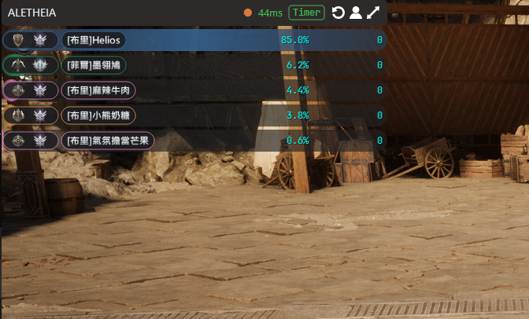
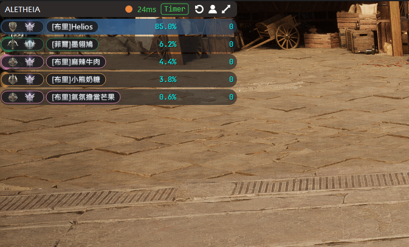
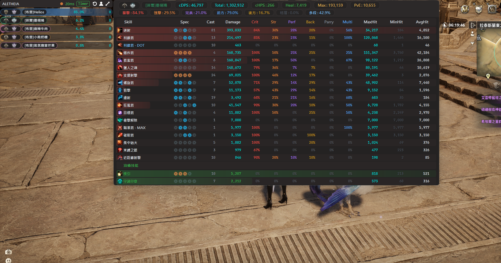
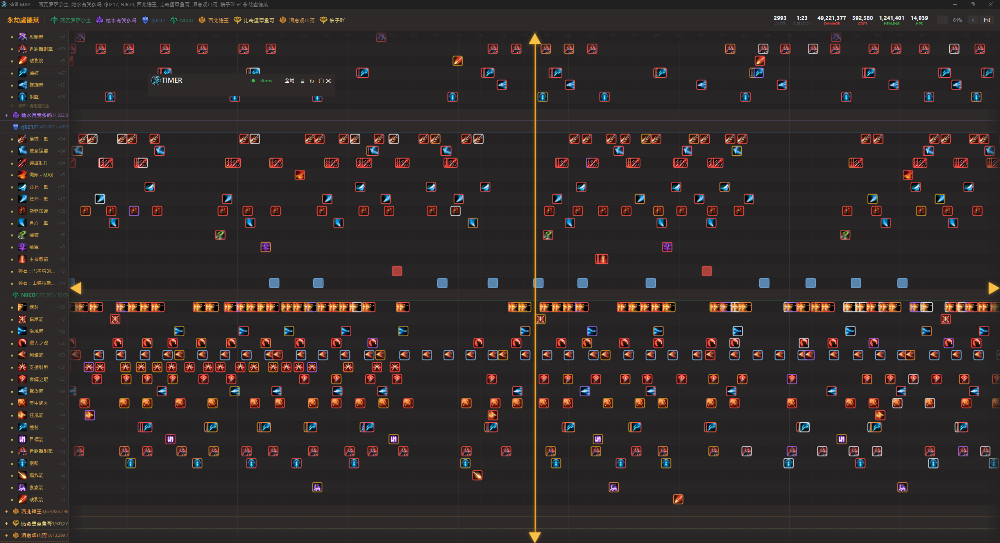
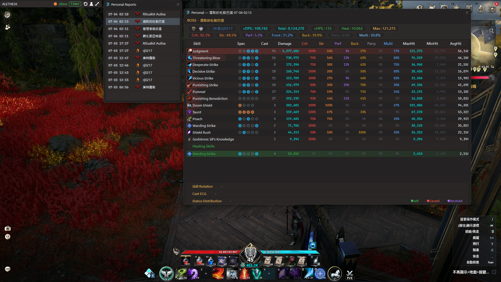
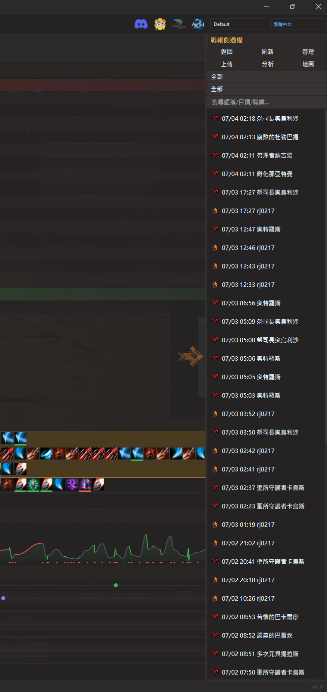
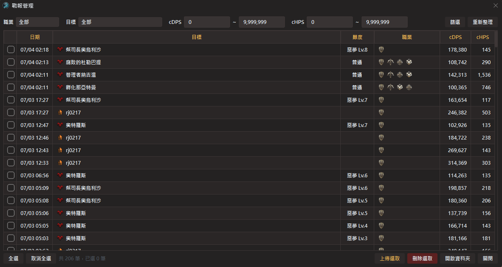
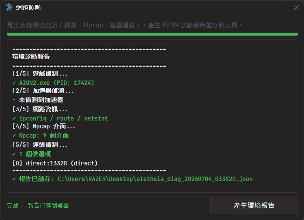
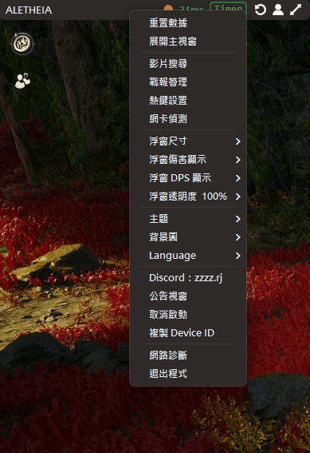

**[English](README.md)** | **繁體中文** | **[简体中文](README_CN.md)**

# Aletheia — AION2 DPS Meter

非侵入式的 AION2（永恆紀元2，台版）即時 DPS 計量器。

透過網路封包分析（Passive Sniffing）技術即時計算戰鬥數據，**不修改遊戲記憶體、不竄改封包、不具備自動化操作功能**。

## 支持本專案

如果這個工具對你有幫助，歡迎支持我們繼續開發：

### ☕ Ko-fi — 推薦

[](https://ko-fi.com/rj0217)

直接連結：[ko-fi.com/rj0217](https://ko-fi.com/rj0217)

### 🏦 銀行轉帳（僅限台灣用戶，中國信託 822）

```
7505-4015-7378
```

### 🪙 加密貨幣 — USDT / USDC（BEP20 / BSC 鏈）

```
0x55c439b27807415e80452f59ba00fee3441a802d
```

### 💬 聯絡

- **Discord**：https://discord.gg/x52CBg4rcE
- **開發者信箱**：dont.stop.ha@gmail.com

您的一杯咖啡，是我們繼續努力的動力。

---


---

## 功能特色

### 三模式系統
- **全域模式** — 統計所有玩家的即時 DPS 排行
- **計時模式** — 木樁專用，10 秒無攻擊自動結算，DOT 不影響計時
- **BOSS 模式** — 白名單 BOSS 自動追蹤，死亡後自動結算

> 舊版副本模式已退役（舊副本戰報仍可讀取）。

### 即時浮窗 (Overlay)
- QPainter 自繪渲染，高效能零延遲
- 無邊框視窗 + 邊界吸附 — 拖曳靠近遊戲視窗邊緣會自動貼齊
- 標題列控制鈕：重置／個人戰報／展開主視窗（v9.0）
- 半透明浮窗，背景透明度僅影響底圖（文字保持不透明）
- Normal / Mini 兩種尺寸切換（右鍵選單）
- 右鍵選單整合自訂功能（尺寸/傷害格式/DPS格式/透明度/背景圖/主題）
- **Hover 技能面板** — 滑鼠懸停排名列即時彈出完整技能明細
- **技能心電圖 Cast ECG** — 波形圖呈現技能施放節奏（波高=傷害量、波色=銜接速度）
- **狀態分布圖** — buff 施放時序 Gantt + 次數膠囊，依方向分色（v9.0）
- **傷害類型膠囊** — 七種傷害類型佔比（暴擊／強擊／完美／前方／後方／格擋／多段），對齊官方水錶（v9.0）
- **DOT 分類** — 同技能直擊與持續傷害自動分開顯示
- **自動定位** — 啟動時自動貼齊遊戲視窗左上角
- 金屬質感暱稱 + 職業色漸層量條 + hover 呼吸光效 + 種族圖標
- 配對狀態燈 + 網路延遲 RTT + 加速器偵測狀態
- 4K DPI 自適應縮放
- 設定持久化（透明度/尺寸/顯示模式自動記憶）

### 遊戲內實際畫面



| Mini 模式 | 戰鬥細節（狀態分布圖 + 傷害類型膠囊） |
|:---:|:---:|
|  |  |

### Skill MAP — 全隊技能時間軸

以 2D 時間軸呈現全隊技能施放記錄 — 「這個時刻，全隊每個人在做什麼」。

- X 軸為時間、Y 軸為每位玩家的每個技能獨立一行
- 多層收合（玩家級 + 技能級）、技能隱藏/恢復
- 框選分析（Alt+拖拽）— 穿透多人統計 casts / damage / CPM
- 技能圖標語意色外框（暴擊紅/強擊橙/完美紫/DoT 淺藍/治癒綠）
- 定位線縮放、Fit 一鍵適配、連續技分組

| 全隊總覽 + 框選統計 | 放大檢視技能細節 |
|:---:|:---:|
|  |  |

### 戰鬥分析
- 技能明細：傷害佔比、暴擊率、平均命中、特化燈號
- 技能時間軸：施放順序紀錄，確認操作手法與連招
- **cHPS 治癒統計** — 戰鬥細節、戰報、分析工具全面支援治癒量統計
- **個人戰報視窗** — 浮窗一鍵開啟最近 20 場本人戰報與完整戰鬥細節（v9.0）
- 戰報系統：BOSS／計時模式結算自動產生戰報
- **戰報管理** — 瀏覽、篩選（職業/cDPS/cHPS 範圍 + 目標）、批量刪除
- **戰報面板** — 主視窗側邊抽屜，搜尋/篩選/上傳一站完成
- **戰報上傳** — 一鍵上傳至永恆蜂窩或 Aletheia 社群，其他玩家自動匿名化（v9.0）
- **戰報分析** — 傷害佔比及同職業歷史平均對比，支援傷害/治癒模式切換及競速模式
- 召喚物傷害自動合併至主人名下
- 治癒技能獨立分區統計（傷害/治癒不互相擠壓）

| 個人戰報視窗（v9.0） | 戰報側邊欄 |
|:---:|:---:|
|  |  |

### 戰報上傳

上傳戰報至永恆蜂窩，查看完整分析與技能時間軸：

| 戰報總覽 | 技能時間軸 |
|:---:|:---:|
|  |  |

### 影片搜尋（YouTube / B站 / Niconico）


### 附屬工具

| 戰報分析（DPS） | 戰報分析（HPS） |
|:---:|:---:|
|  |  |

| 戰報分析（競速模式） | 戰報管理 |
|:---:|:---:|
|  |  |

| 網卡選擇 | 環境診斷 |
|:---:|:---:|
|  |  |

| 右鍵選單（統一） |
|:---:|
|  |

- **Aletheia Analyzer** — 戰報分析工具，DPS/HPS/競速三種模式，查看個人表現與歷史平均對比
- **Aletheia SkillMAP** — 全隊技能時間軸，以 2D MAP 呈現全隊技能施放記錄
- **環境診斷** — 整合至主視窗，一鍵蒐集系統資訊匯出 JSON 報告

### 其他
- 永恆蜂窩 PvE 評分 / 頭像 API 查詢
- 伺服器識別（36 伺服器）
- JSON 自訂主題系統（深色/淺色基礎群，顏色、字體、背景）
- 通用加速器相容（ExitLag / UU / 雷神 / GearUP / LagoFast / Clash）
- 加速器自動偵測 — 狀態列顯示偵測到的加速器名稱及 port，封包中斷自動切換候選連線
- 自動角色偵測（進入遊戲後自動識別暱稱）
- 系統匣常駐（關閉主視窗不退出，雙擊圖示叫回）
- 快捷鍵改用 Win32 API，軟體巨集使用者不再卡頓
- 三語切換（繁體中文 / 简体中文 / English），即時生效無需重啟
- 技能/副本/BOSS 名稱英文化

---

## 安裝與使用

### 系統需求
- Windows 10/11
- [Npcap](https://npcap.com/#download)（安裝時勾選「Install Npcap in WinPcap API-compatible Mode」）

### 快速上手
1. 安裝 Npcap
2. 下載最新版本 → [Releases](../../releases)
3. 解壓縮後，**右鍵 → 以系統管理員身份執行**
4. 首次啟動需以 Discord 帳號登入才能進入主視窗。可選擇輸入 `AION2-XXXX-XXXX` 序號啟用 Pro — 未啟用時主視窗會被模糊遮罩，但浮窗與基礎監控仍可使用。
5. 進入遊戲即可看到數據

### 全域快捷鍵
| 快捷鍵 | 功能 |
|--------|------|
| `Alt+Q` | 顯示 / 隱藏浮窗 |
| `Alt+E` | 顯示 / 隱藏主視窗 |

> 快捷鍵可透過右鍵選單或 settings.json 自訂。

---

## 常見問題

**Q: 為什麼沒有數據？**

A: 請確認已安裝 Npcap（WinPcap 相容模式）、以管理員身分執行、且遊戲正在執行中。

**Q: 延遲有數值但完全沒有傷害數據？**

A: v8.0 已自動相容大部分加速器，支援候選連線自動切換。若仍有問題，請使用主視窗內建的環境診斷功能進行自檢。

**Q: 為什麼一直跳防毒偵測？**

A: Windows Defender 的 ML 模型會對未購買 EV 簽章的程式產生誤判。目前請將主程式及輔助工具加入排除清單。未來有資金時會考慮購買 EV 程式碼簽章憑證。

**Q: 數據準確嗎？**

A: v8.0 包含連續技分組、DOT 分類、技能合併及解析精度提升，傷害數據更加精確。神石傷害、召喚物傷害均已計入總量。v9.0 並將傷害協議（強擊／暴擊／後方／多段）與官方水錶完全對齊。

**Q: 獨佔全螢幕下看不到浮窗？**

A: 獨佔全螢幕會繞過 Windows DWM 合成層，所有置頂浮窗（含 Discord／Steam／NVIDIA）都會失效。請改用「無邊框全螢幕／視窗化全螢幕」，視覺效果等同全螢幕且浮窗可正常顯示。

---

## 免責聲明

本程式僅供技術交流與戰鬥數據分析使用。僅透過網路封包分析技術計算戰鬥數據，不修改遊戲記憶體、不竄改通訊封包，亦不具備任何自動化操作功能。

儘管採非侵入式設計，但官方對「第三方輔助程式」定義不一。使用前請自行評估 AION2 官方政策。若因使用本工具導致帳號受限或任何損失，開發者不負法律責任或補償義務，執行程式即視為同意此聲明。

---

## 聯絡

- Discord：https://discord.gg/x52CBg4rcE
- 開發者信箱：dont.stop.ha@gmail.com

贊助渠道請見頂部的 [支持本專案](#支持本專案) 區塊。
